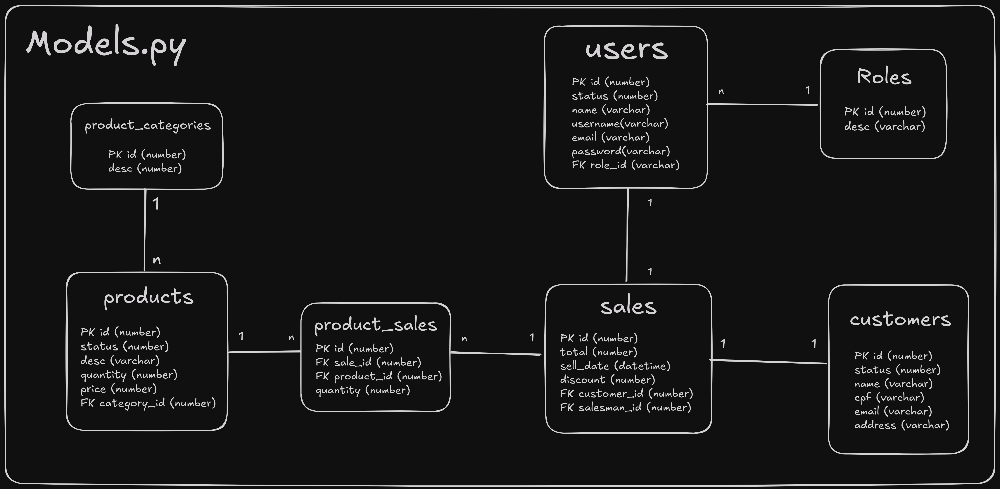

# Sistema de Gerenciamento de Estoque

## Introdução

O projeto é um sistema web de gerenciamento de estoque desenvolvido com Flask. Ele combina uma API RESTful para comunicação com o banco de dados e páginas dinâmicas para interação com o usuário. O objetivo principal é fornecer uma solução eficiente para o controle de produtos, clientes e vendas.

Este projeto foi desenvolvido para solidificar e aprimorar o meu conhecimento com o micro-framework Flask, incluindo a criação de APIs RESTful, modelagem de bancos de dados e desenvolvimento frontend com Bootstrap e Javascript.

A API RESTful integrada é consumida via AJAX/FETCH para operações dinâmicas na interface. Atualmente, a API não está disponível para consumo externo, mas pode ser expandida para integração com outras aplicações no futuro.

Neste sistema, é possível cadastrar Produtos, Usuários e Clientes, além de associá-los um registro de Vendas. É possível também realizar a edição de dados específicos de cada um e torná-los ativos ou inativos de acordo com a necessidade.

## Tecnologias Utilizadas


## Sumário

1. [Instalação](#instalação)
    a. [Instalação de Dependências](#1-instalação-das-dependências)
    b. [Instalação da Aplicação](#2-instalação-da-aplicação)
2. [Estrutura do Projeto](#estrutura-do-projeto)
    a. [Modelagem do Banco de Dados](#modelagem-do-banco-de-dados)
    b. [Estrutura de Arquivos](#estrutura-de-arquivos)
3. [Rotas da API](#rotas-da-api)
    a. [Página Home e Login](#página-home-e-login)
    b. [Inventário](#inventário-produtos-e-categorias)
    c. [Clientes](#clientes)
    d. [Usuários](#usuários)
    e. [Vendas](#vendas)

## Instalação

### 1. Instalação das Dependências

- [Python 3.13.1](https://www.python.org/downloads/release/python-3131/)
- [WKHTMLTOPDF](https://wkhtmltopdf.org/downloads.html)
    

### 2. Instalação da aplicação

Clonagem do repositório GIT
```bash
git clone git@github.com:vToshio/sistema-inventario-flask.git
```

Setup do Ambiente
```bash
cd sistema-inventario-flask

python3 -m venv venv

# Para Linux
source venv/bin/activate

# Para Windows
.\venv\bin\Activate.ps1

pip install -r requirements.txt
```

Executando o Sistema
```bash
python3 run.py
```

## Estrutura do Projeto

### Modelagem do Banco de Dados



### Estrutura de Arquivos

Cada página da aplicação tem uma pasta específica na pasta src contendo três arquivos:
- \_\_init__.py: que inicializa a pasta como um package
- forms.py: que define os formulários utilizados utilizando a lib flask_wtf
- routes.py: que define as cada endpoint da API relacionada à página em questão

A única exceção é a página home, que não possui um arquivo forms.py.
```
SISTEMA DE ESTOQUE
├── app --> Contém os arquivos utilizados da aplicação web
│   ├── __init__.py --> Define a função create_app() que importa configurações e retorna o app, executado no run.py
│   ├── config.py --> Configurações do FlaskApp
│   ├── helpers.py --> Funções auxiliares e ferramentas como BCrypt e CSRFProtect
│   ├── models.py --> Definição do Banco de Dados utilizando Flask SQLAlchemy
│   ├── src --> Código fonte
│   │   ├── customers
│   │   │   ├── __init__.py
│   │   │   ├── forms.py
│   │   │   └── routes.py
│   │   ├── home
│   │   │   ├── __init__.py
│   │   │   └── routes.py
│   │   ├── inventory
│   │   │   ├── __init__.py
│   │   │   ├── forms.py
│   │   │   └── routes.py
│   │   ├── login
│   │   │   ├── __init__.py
│   │   │   ├── forms.py
│   │   │   └── routes.py
│   │   ├── sales
│   │   │   ├── __init__.py
│   │   │   ├── forms.py
│   │   │   └── routes.py
│   │   └── users
│   │       ├── __init__.py
│   │       ├── forms.py
│   │       └── routes.py
│   ├── static --> contém os arquivos estáticos da aplicação (imagens, css, js...)
│   │   ├── css
│   │   │   ├── base.css
│   │   │   ├── home.css
│   │   │   └── login.css
│   │   ├── images
│   │   │   └── favicon.png
│   │   └── javascript
│   │       ├── counters.js --> script dos contadores renderizados na página home
│   │       ├── load_customers.js --> integração com a API de clientes
│   │       ├── load_inventory.js --> integração com a API de produtos
│   │       ├── load_sales.js --> integração com a API de vendas
│   │       ├── load_users.js --> integração com a API de usuários
│   │       └── toasts.js --> renderização de flashs levantados pelo back-end, caso presentes
│   └── templates --> contém os templates de cada página da aplicação.
│       ├── base.html --> template base que inclui o conteúdo das demais páginas em um bloco 'content'
│       ├── clientes.html
│       ├── estoque.html
│       ├── home.html
│       ├── login.html
│       ├── nota_fiscal.html --> nota fiscal renderizada dinâmicamente em HTML e que é baixada no formato PDF.
│       ├── usuarios.html
│       └── vendas.html
├── LICENSE
├── README.md
├── requirements.txt --> libs necessárias ao realizar a instalação do ambiente
└── run.py --> arquivo que executa o FlaskApp
```


## Rotas da API

O sistema utiliza um padrão de nomenclatura que facilita a identificação das operações. Por exemplo, o endpoint _inventory.get_products_ indica a obtenção de uma lista de produtos, enquanto o endpoint _inventory.new_product_ indica o registro de um novo produto.

Foram utilizados os **métodos HTTP**:
- **GET**: para renderização de páginas, pesquisas e obtenção de objetos (produtos, categorias, clientes, usuários, vendas)
- **POST**: para criação de um novo objeto
- **PUT**: para edição de mais de um atributo de um registro
- **PATCH**: para a atualização de um único atributo de um registro (ex: mudar senha, ativar e desativar status...)
- **DELETE**: para a deleção efetiva de um registro no banco de dados (apenas deleção de categorias)

### Página Home e Login

```
Endpoint                           Methods  Rule                                  
---------------------------------  -------  --------------------------------------
home.render_page                   GET      /sistema/home                                      

login.root                         GET      /                                     
login.render_page                  GET      /sistema/login                        
login.logout                       GET      /sistema/logout                       
login.validate_login               POST     /sistema/login/validate   
```
Nenhum desses endpoints retorna informações em JSON.

### Inventário (Produtos e Categorias)

```
Endpoint                           Methods  Rule                                  
---------------------------------  -------  --------------------------------------
inventory.render_page              GET      /sistema/home/estoque                 

inventory.get_categories (JSON)    GET      /api/categories                       
inventory.new_category             POST     /api/categories/new                   
inventory.delete_category (JSON)   DELETE   /api/categories/delete/<int:id>       

inventory.get_products             GET      /api/products                         
inventory.search_products (JSON)   GET      /api/products/search  
inventory.get_product (JSON)       GET      /api/products/<int:id>                
inventory.edit_product (JSON)      PUT      /api/products/edit/<int:id>           
inventory.new_product              POST     /api/products/new                     
inventory.add_units (JSON)         PATCH    /api/products/add-units/<int:id>      
inventory.disable_product (JSON)   PATCH    /api/products/disable-status/<int:id> 
inventory.enable_product (JSON)    PATCH    /api/products/enable-status/<int:id>  
```

### Clientes

```
Endpoint                                  Methods  Rule                                  
----------------------------------------  -------  --------------------------------------
customers.render_page                     GET      /sistema/home/clientes                

customers.get_customers (JSON)            GET      /api/customers                        
customers.get_customer (JSON)             GET      /api/customers/<int:id>               
customers.search_customers (JSON)         GET      /api/customers/search      
customers.edit_customer (JSON)            PUT      /api/customers/edit/<int:id>          
customers.new_customer                    POST     /api/customers/new                    
customers.disable_customer_status (JSON)  PATCH    /api/customers/disable-status/<int:id>
customers.reactivate_customer (JSON)      PATCH    /api/customers/enable-status/<int:id> 
```

### Usuários

```
Endpoint                           Methods  Rule                                  
---------------------------------  -------  --------------------------------------
users.render_page                  GET      /sistema/home/usuarios                
users.get_user (JSON)              GET      /api/users/<int:id>                   
users.get_users (JSON)             GET      /api/users                            
users.search_users (JSON)          GET      /api/users/search
users.edit_user (JSON)             PUT      /api/users/edit/<int:id>              
users.new_user                     POST     /api/users/new                        
users.change_password (JSON)       PATCH    /api/users/change-password/<int:id>   
users.edit_role (JSON)             PATCH    /api/users/edit-role/<int:id>         
users.enable_status (JSON)         PATCH    /api/users/enable-status/<int:id>     
users.disable_status (JSON)        PATCH    /api/users/disable-status/<int:id>    
```

### Vendas

```
Endpoint                           Methods  Rule                                  
---------------------------------  -------  --------------------------------------       
sales.render_page                  GET      /sistema/home/vendas                  
sales.get_sales                    GET      /api/sales                            
sales.search_sale                  GET      /api/sales/search                                
sales.download_pdf                 GET      /sistema/home/vendas/<int:sale_id>    
sales.register_sale                POST     /api/sales/register-sale              
```
Nenhum destes endpoints retorna informações em JSON.